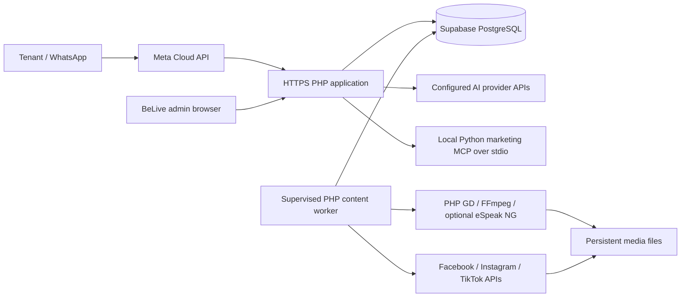

# BeLive IT deployment and operations handover

Prepared for the BeLive IT department on **9 October 2026 (Malaysia time)**.
This guide explains how to install, operate, back up and transfer the Eve
automation system. It contains no passwords, API keys or tenant records.

## 1. Current installation and handover status

| Item | Status at handover |
|---|---|
| Source repository | `https://github.com/WYX10/belive-automation-engine` |
| Deployed application revision | `d4307ddea9557ec9e6221654c88e39b3b68f23c5` |
| Web hosting | Azure App Service, Linux, PHP 8.2.30 |
| Database | Supabase PostgreSQL, Session pooler, port 5432, private schema `belive` |
| Deployment | GitHub Actions successfully deployed the revision above |
| Connection and schema | Azure SSH check reported an encrypted TLS connection and matching PostgreSQL migration checksums |
| Records observed in that check | 29 leads, 192 rooms, 29 tenant requirement profiles, 31 feedback records, 27 learned memories, 23 content posts |
| Admin dashboard | User confirmed that the deployed dashboard opens |
| Remaining operational acceptance | IT must verify live messaging, provider credentials, MCP execution, media rendering, worker supervision, scheduled delivery and backup restoration |

These counts describe the migration check, not permanent expected totals. The
check verified schema checksums and selected table counts; it did not establish
that every external integration works or compare every live record with the dump.
Local validation before deployment included 762 PostgreSQL assertions, 753 MySQL
assertions and five backup-conversion tests. Those checks do not establish live
WhatsApp or social delivery.

For an existing installation, **preserve the current `APP_ENCRYPTION_KEY`**.
Provider credentials in the database are encrypted with it. A new key cannot
decrypt existing credentials. Transfer secrets through BeLive's approved secret
manager, separately from this document.

## 2. What the system runs



The PHP application serves the website, admin panel, tenant/owner portals and
webhooks. Tenant requirements are saved in `tenant_requirements`. Feedback and
shared lessons are stored in `ai_feedback` and `ai_learned_memory`; duplicate
identities and scoped locks protect repeated learning. Learning still needs
review: an AI can miss an error or fail to identify a semantic duplicate.

The marketing MCP uses the official Python MCP SDK and starts on demand. It is
a local child process, not an Internet-facing server. It handles qualification,
room benefits and rental objections. It does not provide general Internet
search, install arbitrary skills, write the database or send tenant messages.

Optional generative video uses a separate hosted Wan image-to-video client.
See [ai_video_setup.md](ai_video_setup.md) for installation, free quota limits,
external-media transfer, job supervision and acceptance. The deployed revision
listed above predates that optional integration; it needs a separate deployment.

Photo rendering uses PHP GD. Video rendering uses CPU-based FFmpeg and the
supplied mascot poses to produce an animated illustrated presenter, with
optional eSpeak NG narration. Uploaded media remains in the filesystem; moving
the database does not move photos, videos or other uploaded documents.

## 3. Select the hosting arrangement

| Arrangement | Suitable use | IT responsibility |
|---|---|---|
| Azure App Service + Supabase | Continue the current installation | Configure the PHP runtime, certificates, persistent media, native rendering/Python dependencies and an independent scheduler |
| Linux VM + Supabase | Full control over workers and media tools | Maintain Linux, Nginx/PHP-FPM, dependencies, TLS, monitoring and backups |
| Linux VM + managed/self-hosted PostgreSQL | Keep database operation under IT control | Also operate PostgreSQL, trusted database TLS, backups and recovery; the schema needs ICU collation support |
| Windows workstation + XAMPP | Development or demonstrations | Use a Linux VM or WSL2 for the full MCP workflow; native Windows creates a different virtualenv path than the PHP MCP bridge expects |

Use Linux for the complete production feature set. The current MCP bridge looks
for `mcp/tenant_marketing/.venv/bin/python`; a native Windows virtualenv normally
uses `Scripts/python.exe` and therefore falls back to built-in guidance.
Use Nginx or Apache with PHP-FPM for production. PHP's built-in `php -S` server
is for local development only.

## 4. Hardware and capacity planning

The following are **starting estimates**, not measured capacity guarantees.
Load-test real tenant traffic and concurrent media creation before assigning an
SLA. AI inference is performed by external APIs, so a local GPU is not required.

| Component | Suggested starting allocation | Notes |
|---|---|---|
| Staff laptop/desktop | 4 CPU cores, 8 GB RAM, modern browser, stable Internet | No PHP or database installation needed for staff using the hosted admin panel |
| Pilot Linux application host | 2 vCPU, 4 GB RAM, 40 GB SSD | Application, small worker workload and limited rendering concurrency |
| Application host with regular video creation | 4 vCPU, 8–16 GB RAM, 100 GB SSD initially | Render one video at a time initially; track CPU, memory and temporary disk use |
| Database | Managed service sized from connections, query latency, data growth and retention | Media capacity is separate from database capacity |
| On-premises hosting | Above server allocation plus UPS, monitored storage and independent backup destination | Stable public HTTPS/webhook access and outbound Internet are still required |

Reserve space for originals, enhanced images, completed reels, temporary render
files and backups. H.264 reels are 1080×1920 at 30 fps. Measure actual output sizes
to set retention limits. A small shared/free web tier may throttle or sleep and
delay scheduled work; video rendering can exhaust small instance memory.

No Node.js, npm, local LLM server or GPU driver is required by this repository.

## 5. Accounts, networking and ownership

Assign a BeLive owner for GitHub, Azure, Supabase, DNS/TLS, Meta Business assets,
AI billing, social accounts, the scheduler, backups and incident response.
Company-controlled accounts should replace personal/student ownership during
handover. Record resource IDs and access roles privately.

| Network direction | Destination | Purpose |
|---|---|---|
| Inbound HTTPS, TCP 443 | Public application origin | Website, admin and provider webhooks |
| Inbound TCP 80, if used | Web server | HTTPS redirect / certificate issuance only |
| Outbound TCP 5432 | Supabase **Session pooler** hostname from Connect | PostgreSQL with certificate verification |
| Outbound HTTPS, TCP 443 | `graph.facebook.com`, `graph.instagram.com` | WhatsApp/Meta and Instagram integrations |
| Outbound HTTPS, TCP 443 | Configured AI providers: `api.anthropic.com`, `generativelanguage.googleapis.com`, `api.openai.com`, `openrouter.ai` | Enable only the providers BeLive uses |
| Outbound HTTPS, TCP 443 | `open.tiktokapis.com`, if configured | TikTok publishing |
| Outbound HTTPS, TCP 443 | Approved room-media URLs and dependency registries | Media retrieval and deployment |

Allow provider servers to fetch the exact public HTTPS media URLs used for
Instagram/TikTok publishing. A staff login page, tunnel interstitial or private
network URL will prevent this. Database ports should not be exposed publicly
on a self-hosted VM. The local MCP needs no open TCP port.

If Supabase network restrictions are enabled, allow the actual web **and worker**
outbound addresses. Azure addresses can change after scaling or plan changes;
record and review them rather than allowing arbitrary source networks.

## 6. Software requirements

| Software | Requirement / purpose |
|---|---|
| PHP | Code requires 8.1+; choose a currently supported release. PHP 8.4 was tested locally; the current Azure deployment uses 8.2.30 and needs a planned runtime upgrade |
| PHP extensions | `pdo_pgsql` for PostgreSQL, `openssl`, `curl`, `mbstring`, `gd`, `json`, `fileinfo`; `pdo_mysql` only for MySQL development/migration work |
| Composer | Install locked PHP dependencies from `composer.lock` |
| Web server | Nginx + PHP-FPM, or Apache configured for the `public/` document root |
| Python | 3.10+; Python 3.12 was used locally |
| uv | Install using IT's approved method; `uv sync --frozen` installs the locked MCP dependencies (`mcp==2.3.0`) |
| FFmpeg and ffprobe | Required for video creation; must support H.264/libx264 and AAC |
| TrueType fonts | DejaVu Sans regular/bold or another configured pair |
| eSpeak NG | Optional offline narration; without it the video retains animation and captions |
| PostgreSQL client tools | `pg_dump` / `pg_restore` for backup; match or exceed the hosted PostgreSQL major version for `pg_dump` |
| zstd | Needed only to convert the original compressed MySQL Shell backup |

PHP must permit `proc_open` for MCP and `exec` for media tools. Detached daily
creation also uses process-launch functions. Allow these only within the
controlled application service account. Provide writable temporary storage.

Check the **running host**, not just the GitHub build machine:

```bash
php -v
php -m
python3 --version
uv --version
ffmpeg -version
ffprobe -version
espeak-ng --version
```

Install/build requirements do not prove that PHP-FPM has the same extensions,
PATH or permissions as CLI PHP. Verify both. For environment-variable-only
configuration, PHP must populate `$_ENV` (`variables_order` includes `E`), and
PHP-FPM must receive the application variables. Many non-database settings read
`$_ENV` directly. A protected project `.env` file is the alternative on a VM.

## 7. Configuration and secret transfer

On Azure, use **Web App → Settings → Environment variables → App settings**.
On a Linux VM, copy `.env.example` to `.env`, fill it privately and restrict it
to the application account (for example, owner `root`, group `www-data`, mode
`0640`). Do not commit `.env`, backups or credentials to Git.

| Setting | What IT supplies |
|---|---|
| `APP_URL` | Actual public HTTPS origin, without a trailing slash |
| `APP_ENV` | `production` |
| `APP_ENCRYPTION_KEY` | **Existing key for an existing/imported database**; generate 32 random bytes, base64 encoded, only for a genuinely new installation |
| `DB_DRIVER` | `pgsql` |
| `DB_HOST` | Session pooler hostname copied from Supabase Connect |
| `DB_PORT` | `5432` |
| `DB_NAME` | `postgres` on Supabase |
| `DB_USER` | Session pooler username copied from Connect (`postgres.<project-ref>` in the current setup) |
| `DB_PASS` | Supabase database password, transferred privately |
| `DB_SCHEMA` | `belive` |
| `DB_SSL_MODE` | `verify-full` |
| `DB_SSL_ROOT_CERT` | Readable CA bundle containing the Supabase certificate; see section 8 |
| `ADMIN_USERNAME` | BeLive's chosen admin account name |
| `ADMIN_PASSWORD_HASH` | A bcrypt password hash; replace the development plaintext example |
| `WA_VERIFY_TOKEN` | Private random string matching the Meta webhook setup |
| `CRON_TOKEN` | Private random token if the HTTP scheduler is used |
| `MOCK_AI` | `false` for real service; `true` only in isolated development |
| `MARKETING_MCP_ENABLED` | `true` after installing the MCP runtime |
| `OWNER_PORTAL_CODE` | Private access code if the current owner portal is enabled |
| `EVE_WA_NUMBER` | BeLive's WhatsApp number, digits only, including country code |
| `FFMPEG_BIN` | Blank when FFmpeg is on the service's PATH, otherwise absolute executable path |
| `PROMO_FONT_BOLD`, `PROMO_FONT_REGULAR` | Blank for auto-detection or absolute paths to readable font files |
| `CONTENT_VIDEO_VOICE` | `true` for eSpeak narration, or `false` to disable it |
| `ESPEAK_BIN` | Blank when eSpeak NG is on PATH, otherwise absolute executable path |
| `AI_VIDEO_PROVIDER` | `illustrated` initially; `huggingface` after provisioning the optional generative-video client |
| `HF_VIDEO_SPACE` | `Wan-AI/Wan-2.2-5B`, the supported official image-to-video Space |
| `HF_VIDEO_API_NAME` | Blank for unambiguous API discovery, or the inspected image-to-video endpoint |
| `HF_VIDEO_TOKEN` | Optional free personal account token, transferred privately; paid/unknown plans are blocked |

For a **new empty** installation only, generate an encryption key privately:

```bash
php -r 'echo base64_encode(random_bytes(32)), PHP_EOL;'
```

The database password and this encryption key are different secrets. Back up
the encryption key in the company's secret manager; a database backup does not
contain it. Re-enter a provider key if its encrypted value cannot be recovered.

Avoid maintaining conflicting Azure App Settings and `.env` values. Verify the
effective configuration in both web and CLI processes without dumping secrets
or exposing `phpinfo()` publicly.

## 8. Azure installation and database certificate

### 8.1 Web app and deployment

1. Continue the existing Linux web app, or create a Linux App Service with a
   supported PHP runtime. Use the actual Azure-generated hostname from Overview;
   it may include a suffix and region.
2. Configure the startup command as:

   ```text
   bash /home/site/wwwroot/deploy/azure/startup.sh
   ```

   The script configures Nginx to serve `public/` and sets upload limits. It
   **does not** install Python, FFmpeg or run a supervised content worker.
3. Configure the application settings from section 7. Keep the existing
   encryption key, admin access, webhook token and uploaded media when taking
   over the existing app. `SCM_DO_BUILD_DURING_DEPLOYMENT=true` can be used for
   Azure's build path; the existing Actions workflow also installs Composer
   dependencies itself.
4. The existing workflow is `.github/workflows/main_belive-engine.yml`. It builds
   PHP/Composer and deploys to `belive-engine` whenever `main` is pushed. Review
   changes before pushing: this is a production deployment trigger. If creating
   another app, update the app name and its GitHub publish-profile secret through
   the approved deployment process. The profile is a credential; never put its
   value in a repository or this document.
5. Provision Python/uv and native media tools in the actual runtime. Prefer a
   maintained custom image or a VM if the built-in image cannot provide them.
   OS changes outside `/home` do not persist in the current Azure container;
   install them in an image or a repeatable startup process. Do not copy a
   workstation virtualenv into Azure.
6. With Python and uv available, run in Azure SSH after deployment:

   ```bash
   cd /home/site/wwwroot
   uv sync --project mcp/tenant_marketing --frozen
   mcp/tenant_marketing/.venv/bin/python -c 'import importlib.metadata; print(importlib.metadata.version("mcp"))'
   ```

   Rebuild the virtualenv after deployment or a Python runtime change. Confirm
   that the PHP worker account can execute it and that `proc_open` is enabled.

### 8.2 Supabase and trusted TLS

1. In Supabase, select the project and open **Connect → Direct → Session pooler**.
   Copy the parameters into the private Azure settings. Use port **5432**.
   Session locks used by learning and posting require a Session pooler; do not
   replace it with transaction pooling on port 6543. Direct IPv6 PostgreSQL is an
   alternative only if the application network supports it.
2. Keep application tables in the private `belive` schema. Keep it outside Data
   API exposed schemas. The baseline enables RLS without browser access policies;
   the trusted PHP backend uses the database owner connection. Review a separate
   restricted runtime role before adopting a different privilege model.
3. Download the project certificate from **Database → Settings → SSL
   Configuration → Download Certificate**. Obtain it from the authenticated
   project dashboard, not from an unverified peer connection.
4. In Azure SSH, create a persistent certificate location:

   ```bash
   mkdir -p /home/belive-certs
   cat > /home/belive-certs/supabase-ca.crt <<'CERT'
   ```

   Paste the complete downloaded PEM certificate, including the BEGIN/END lines.
   Then type `CERT` alone on a new line and press Enter. Validate and build a
   bundle with the system CAs:

   ```bash
   openssl x509 -in /home/belive-certs/supabase-ca.crt -noout -subject -issuer -dates
   cat /etc/ssl/certs/ca-certificates.crt /home/belive-certs/supabase-ca.crt > /home/belive-certs/database-ca.pem
   chmod 644 /home/belive-certs/supabase-ca.crt /home/belive-certs/database-ca.pem
   ```

5. Set `DB_SSL_ROOT_CERT=/home/belive-certs/database-ca.pem`, retain
   `DB_SSL_MODE=verify-full`, save/apply settings and restart the app. Keep the
   certificate readable by web and worker accounts. Rebuild the bundle when
   rotating the Supabase certificate or updating system trust.

The Azure migration originally failed with `certificate verify failed` before
the successful connection check. Correct the trust chain/path; do not fix this
by disabling TLS or server verification. On a VM, use a location such as
`/etc/belive/certs/database-ca.pem` and configure the corresponding absolute path.

### 8.3 Database initialization

For a **new empty** database, or to check the current migration version:

```bash
cd /home/site/wwwroot
php database/migrate.php
```

For the **already imported BeLive database**, do not rerun the original import
or seed demo data. The PostgreSQL runner checks migration checksums and applies
only unapplied files. New PostgreSQL migrations belong in
`database/postgres/migrations`; do not edit an already applied migration.

## 9. Linux VM installation alternative

The example uses `/srv/belive`, a `www-data` service account and Ubuntu 24.04 LTS.
Adjust PHP-FPM socket/version paths to IT's actual installation. Use the current
supported PHP packages approved by IT; Ubuntu's default PHP may differ from the
locally tested PHP 8.4.

Install the required packages, with administrative access:

```bash
sudo apt-get update
sudo apt-get install nginx php-fpm php-cli php-pgsql php-gd php-curl php-mbstring php-xml php-zip composer python3 python3-venv ffmpeg fonts-dejavu-core espeak-ng postgresql-client git ca-certificates
```

Install uv using IT's approved method. Clone the repository into `/srv/belive`
using the deployment account, select an approved release/commit, then run:

```bash
cd /srv/belive
composer install --no-dev --no-interaction --prefer-dist --optimize-autoloader
uv sync --project mcp/tenant_marketing --frozen
cp .env.example .env
```

Fill `.env` privately using section 7; install the trusted database CA bundle
using section 8. Keep code read-only to the web account. Allow writes only where
needed, including these directories and the application's temporary directory:

```bash
sudo install -d -o www-data -g www-data /srv/belive/storage /srv/belive/public/assets/img/uploads/rooms /srv/belive/public/assets/img/uploads/branded /srv/belive/public/assets/img/uploads/videos
sudo chown root:www-data /srv/belive/.env
sudo chmod 640 /srv/belive/.env
sudo -u www-data /usr/bin/php /srv/belive/database/migrate.php
```

Configure Nginx with `root /srv/belive/public`, HTTPS with a trusted certificate,
and `try_files $uri /index.php$is_args$args` for the front controller. Pass
`/index.php` to the installed PHP-FPM socket; deny other direct PHP execution
and dotfiles. Do not expose `src/`, `vendor/`, `.env`, database dumps or the MCP
directory over HTTP. The Azure-specific Nginx configuration is a reference,
not a VM configuration to copy unchanged.

Set PHP production error display off and error logging on. Keep logs private.
Align PHP and Nginx upload limits with the application: room photos are limited
to 5 MB, the Azure example uses an 8 MB request limit, and larger video uploads
need deliberate review of all applicable limits. Restart PHP-FPM after changing
extensions, environment delivery or configuration.

## 10. AI, WhatsApp and social account setup

Log in at `<APP_URL>/admin/login`. Add keys through **Admin → API credentials**,
then test and activate them. Choose currently available models under
**Admin → AI Models**; the README's example model names are not a guarantee of
provider availability. The application supports Anthropic, Gemini, OpenAI and
OpenRouter. Configure at least the providers needed by the selected phases.

| Integration | Required setup and acceptance |
|---|---|
| WhatsApp | Meta Business app, WhatsApp number ID and usable token; callback `<APP_URL>/webhook/whatsapp`; matching `WA_VERIFY_TOKEN`; subscribe to messages; test a real tenant reply and delivery status |
| Facebook | Page token and `page_id` in `meta_graph`; subscribe the Page to the app; callback `<APP_URL>/webhook/meta`; required permissions/app review for public use |
| Instagram | Professional account and appropriate permissions; configure either Instagram Login (`instagram`, `ig_user_id`) or the supported Facebook Login path (`meta_graph`, `ig_user_id`); verify public media fetches |
| TikTok | Approved app/account access and usable publishing credentials; verify the provider's current posting restrictions and media requirements |

Development/test tokens and accounts with app roles are insufficient evidence of
public tenant service. Establish company-controlled tokens, renewal ownership,
approved permissions and provider budgets. Set `MOCK_AI=false` for live use.
Detailed Meta setup is in [setup_guide.md](setup_guide.md).

The current application has a single admin account and shared owner access code.
It is not an enterprise SSO/RBAC system. IT must review authentication, portal
access and tenant data exposure before a wider rollout. The webhook verify
token proves callback registration; the current receiver does not implement a
Meta POST payload signature check. Add reviewed signature validation and assess
rate limits/access controls before unrestricted public operation.

## 11. Scheduling and background services

**Opening the admin dashboard is not a reliable scheduler.** Configure an
independent worker or authenticated scheduler, verify it after restarts, and
record its owner. The GitHub deployment workflow does not start one.

### Option A: persistent worker (preferred for Linux VMs)

Run the content worker with the same database/configuration as the web app:

```bash
php cron/content_worker.php --interval=30 --max=10
```

It polls delivery every 30 seconds and dispatches daily creation in a separate
process. For `/srv/belive`, install this as
`/etc/systemd/system/belive-content.service`:

```ini
[Unit]
Description=BeLive content delivery and drafting worker
Wants=network-online.target
After=network-online.target

[Service]
Type=simple
User=www-data
Group=www-data
WorkingDirectory=/srv/belive
ExecStart=/usr/bin/php /srv/belive/cron/content_worker.php --interval=30 --max=10
Restart=always
RestartSec=10
NoNewPrivileges=true
PrivateTmp=true

[Install]
WantedBy=multi-user.target
```

Enable and inspect it:

```bash
sudo systemctl daemon-reload
sudo systemctl enable --now belive-content
sudo systemctl status belive-content
sudo journalctl -u belive-content --since today
```

Use the existing `.env` so both PHP-FPM and the worker receive all settings.
Restart the worker after code, keys, runtime or DB changes. On Azure use a
supported supervisor/container worker or a separate supported worker host. Do
not rely on an SSH terminal or `nohup` process surviving deployments.

### Option B: external HTTPS scheduler (for managed hosting)

Invoke **POST `<APP_URL>/cron/content` every minute** with
`Authorization: Bearer <CRON_TOKEN>`. Store the token in the scheduler's private
credential facility. This route handles delivery and dispatches daily creation.
It returns 404 when the token is missing/incorrect. Never put the token in query
strings, public logs or the repository. This endpoint can publish approved
queued posts; it is not a read-only health check.

Choose a scheduler with a cadence and SLA matching BeLive's needs. GitHub Actions
scheduled workflows can be delayed and do not offer an exact one-minute SLA.
A free/sleeping host can also delay processing even with an external scheduler.

### Additional periodic jobs

| Command | Suggested cadence | Purpose |
|---|---|---|
| `php cron/learning_job.php` | Every 15–30 minutes | Pending feedback and aggregate learning |
| `php cron/memory_decay.php` | Daily | Retire stale low-confidence rules |
| `php cron/refresh_engagement.php` | Hourly | Retrieve platform engagement |

Schedule these through the VM's cron/systemd timers or IT's job runner with the
same environment and service identity. Example `/etc/cron.d/belive` on the VM:

```cron
*/15 * * * * www-data /usr/bin/php /srv/belive/cron/learning_job.php >> /srv/belive/storage/learning.log 2>&1
15 2 * * * www-data /usr/bin/php /srv/belive/cron/memory_decay.php >> /srv/belive/storage/memory-decay.log 2>&1
0 * * * * www-data /usr/bin/php /srv/belive/cron/refresh_engagement.php >> /srv/belive/storage/engagement.log 2>&1
```

Cron uses the host's timezone; set/record it, for example Asia/Kuala_Lumpur.
Rotate these logs. The Azure image does not provide a dependable managed cron
service; provision a job runner rather than assuming these entries run there.

If using a once-per-minute CLI task instead of a persistent worker, run
`php cron/content_worker.php --once` **and** schedule
`php cron/auto_draft_content.php --if-due`; `--once` only processes delivery.
Avoid adding the legacy publisher/retry jobs alongside the chosen content
worker unless IT deliberately manages the overlap.

### Content studio settings and delivery behavior

Set **Draft from**, **Daily posting time**, approval defaults and the automatic
daily scheduling preference in Content studio. Posting time is
**Asia/Kuala_Lumpur (UTC+8)**. Database connection timestamps/retry bookkeeping
use UTC. Changing daily defaults affects new drafts, not already queued posts.

Review automatic approval before enabling it. Test against an authorized test
account. A due post starts on the next worker poll; platform upload/processing
adds latency. Missing credentials leave scheduled posts queued. An `uncertain`
outcome requires checking the provider before retrying; a blind retry can create
a duplicate. See [content_studio.md](content_studio.md).

## 12. Existing database transfer versus a new installation

The current Supabase database has already been imported. For another migration,
pause writes and publishing for the final copy so new tenant messages are not
lost. Preserve IDs, the encryption key, private application configuration and
media together. See [supabase_migration.md](supabase_migration.md).

The MySQL Shell ZIP is not PostgreSQL SQL. The repository converter validates
the extracted dump and creates a private-schema import in one transaction. It
refuses an existing target schema; it is not an overwrite/update mechanism.
The resulting SQL contains tenant records and encrypted provider credentials:
keep it private and transfer it securely. Do not post it in a public issue.

For a new empty installation, run migrations and then import only the approved
BeLive room inventory. `database/seed.php` and example seed material are demo
data; do not run them against the current production database. Database records
that reference media will remain broken until the files are transferred too.

Stop workers during final copying/cutover and resume them only after verifying
the new connection. Keep the previous database until reconciliation and restore
tests pass. Reverting to an old database after accepting new writes on Supabase
requires data reconciliation; it is not a safe blind connection-setting change.

## 13. Acceptance checks

Run these with IT's test accounts and an approved test posting destination.

| Check | Evidence to record |
|---|---|
| HTTPS and `/health` | Valid HTTPS and an `ok` response; this is application liveness only and does **not** test the database |
| Database | TLS/schema check below passes; migrated counts/contents reconcile with the approved backup |
| Admin and catalog | Admin login works; room details, prices and photos display correctly |
| Tenant message | New WhatsApp message creates/updates a lead and receives a real delivered reply |
| Requirements | Change budget/location/tenure, continue the conversation and confirm the saved profile is used |
| Learning | Flag/correct an error, review the lesson, then reprocess the same feedback and confirm no duplicate identity is created |
| MCP | Activity log shows `marketing_mcp_used`; investigate `marketing_mcp_fallback` rather than assuming SDK installation succeeded |
| Image and video | Render real room media; verify corrections, mascot placement/motion, captions and optional narration |
| Scheduled posting | Schedule a reviewed test post; close the browser; verify worker heartbeat, actual provider post ID/URL and selected Malaysian posting time |
| Restart | Restart the app/worker; confirm supervision, certificate paths and media survive |
| Recovery | Restore a backup to an isolated environment and decrypt a test provider credential using the retained key |

For an Azure read-only database/schema check using existing app settings:

```bash
cd /home/site/wwwroot
SUPABASE_DB_HOST="$DB_HOST" \
SUPABASE_DB_PORT="$DB_PORT" \
SUPABASE_DB_NAME="$DB_NAME" \
SUPABASE_DB_USER="$DB_USER" \
SUPABASE_DB_PASS="$DB_PASS" \
php database/supabase_check.php --require-import
```

Expected messages: `Supabase connection verified over TLS.` and
`Imported application schema verified.` It does not print the password or
change database settings/data. On a VM with `.env` rather than exported shell
variables, provide the five `SUPABASE_DB_*` settings privately for this check.
Keep `DB_SSL_MODE=verify-full`; the TLS status message alone does not certify
the selected verification mode.

Run automated suites only in an isolated development/CI installation with local
throwaway databases. `php tests/run.php` rebuilds a `_test` database/schema;
PostgreSQL tests require a loopback host. Do not substitute production settings
or use tests as a production health check. MCP-only checks can run with:

```bash
mcp/tenant_marketing/.venv/bin/python -m unittest discover -s mcp/tenant_marketing -p 'test_*.py'
```

## 14. Backup, restore and maintenance

Assign an owner and agree recovery objectives with BeLive. A starting proposal
is a nightly backup and a monthly restore drill; this is not an implemented
backup service or an SLA. Increase frequency if losing a day's tenant messages
is unacceptable. Check current Supabase plan backup/retention features rather
than assuming the free plan provides recovery coverage.

Back up these separately, encrypting sensitive material and keeping a copy
outside the running host:

| Asset | Recovery requirement |
|---|---|
| `belive` PostgreSQL schema and data | All tenants, conversations, settings, learned rules, content metadata and migration records |
| `APP_ENCRYPTION_KEY` and private configuration | Store in the company's secret manager, separately from the SQL dump |
| `public/assets/img/uploads/` | Room uploads, enhanced photos, branded images and rendered videos |
| Other uploaded files and `storage/` | Include any instance-specific documents/files; review logs separately for retention |
| Source revision and deployment configuration | Keep the approved commit, runtime versions, startup/worker setup and access ownership |
| Certificate bundle and renewal instructions | Reinstall database trust and public HTTPS during recovery |

Use an approved PostgreSQL client and a mode-0600 password file/secret injection,
not a password in the command or connection URI. Example schema backup, with
host/user placeholders replaced and a private `PGPASSFILE` already configured:

```bash
umask 077
PGSSLMODE=verify-full PGSSLROOTCERT=/home/belive-certs/database-ca.pem \
pg_dump --host="SESSION_POOLER_HOST" --port=5432 \
  --username="POOLER_USER" --dbname=postgres --schema=belive \
  --format=custom --no-owner --no-acl --file=belive-backup.dump
```

This is an application-schema backup, not a Supabase `auth`/`storage` backup.
If IT later uses those services, add separate recovery procedures. Validate
backup exit status, file size and retrieval. Test `pg_restore` into a separate,
empty database/project, restore media/configuration, and perform acceptance
checks. Do not restore over the live schema as an experiment.

Monitor HTTP errors, DB connections/latency, disk use, worker heartbeat, queue
age, failed/uncertain deliveries, credential expiry, AI costs and backup jobs.
Review Learning log and Activity log. Application activity can contain tenant
information; restrict access, redact exports and agree retention/deletion rules
with BeLive. Patch PHP/Linux/Python dependencies through staging, keep lockfiles,
review immutable migration checksums and test renders after FFmpeg upgrades.

Before each release: back up, review queued posts, stop/restart workers under
the deployment procedure, deploy the approved revision, run migrations, perform
smoke checks and inspect delivery outcomes. Do not automatically repeat an
interrupted external publish without checking whether it already appeared.

## 15. Troubleshooting

| Symptom | Checks / response |
|---|---|
| `certificate verify failed` | Supabase certificate source/expiry, complete PEM contents, bundle path, web/CLI readability and saved settings; keep `verify-full` |
| Password authentication failure | Correct Session pooler user, password rotation and effective settings; never dump the password to logs |
| Missing tables / checksum mismatch | Correct `belive` schema and approved code revision; do not modify recorded migration checksums to bypass the error |
| Provider credential is unreadable | Restore the original encryption key or re-enter that credential privately |
| MCP fallback | Linux `.venv/bin/python` exists, locked SDK installed, service execute permissions and PHP `proc_open`; inspect Activity log |
| Video option unavailable / render failure | PHP GD, fonts, FFmpeg codecs/ffprobe, PATH, `exec`, temp storage, memory and write permissions |
| Scheduled post remains queued | Worker/scheduler heartbeat, actual due time, account activation, saved approval and retry state |
| Delivery marked uncertain | Check the platform for an existing post before confirming a retry |
| `/health` works but pages fail | Health does not query DB; run the TLS/schema check and inspect PHP logs |
| Web works but CLI fails | Compare effective non-secret settings, environment propagation, extensions and CA path in both processes |
| Images fail after redeployment | Restore persistent uploads, verify public HTTPS media URLs and deployment preservation settings |

## 16. Cost planning and final handover checklist

Supabase's free plan does not make the whole system free. Budget for the web
plan, worker uptime, media storage/egress, AI calls, current messaging/publishing
fees, backups and monitoring. Set budgets/alerts and review quotas regularly.
An Azure B1 plan is paid even when the app is idle/stopped. F1 is a development
option with quotas/sleeping limitations and no Always On; it cannot guarantee
continuous timely publishing. Confirm current vendor pricing before choosing.

- [ ] Company ownership/access recorded for repository, cloud resources and integrations.
- [ ] Approved application revision, runtime versions, hosting capacity and public URL recorded.
- [ ] Secrets transferred privately; exposed development passwords rotated.
- [ ] Original encryption key retained; provider credentials decrypt correctly.
- [ ] Database schema, TLS verification, private API exposure and migrated data checked.
- [ ] Native media tools and actual MCP execution verified on the running host.
- [ ] Worker/scheduler and periodic jobs supervised and tested after a restart.
- [ ] Live messaging and a reviewed scheduled post confirmed with provider evidence.
- [ ] Database, media and key recovery tested in isolation; retention and recovery targets agreed.
- [ ] Authentication/webhook hardening and tenant-data handling reviewed for production use.
- [ ] Monitoring, budgets, credential renewal and incident contacts assigned.
- [ ] Old Azure MySQL removed only after final reconciliation and acceptance sign-off.

Related references: [Supabase migration](supabase_migration.md),
[tenant conversation and learning](tenant_conversation.md),
[content studio](content_studio.md), [API reference](api_reference.md), and
[Supabase SSL guidance](https://supabase.com/docs/guides/platform/ssl-enforcement).
